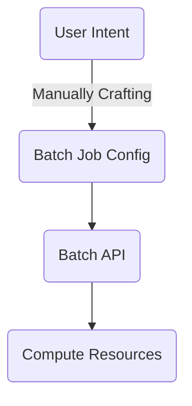
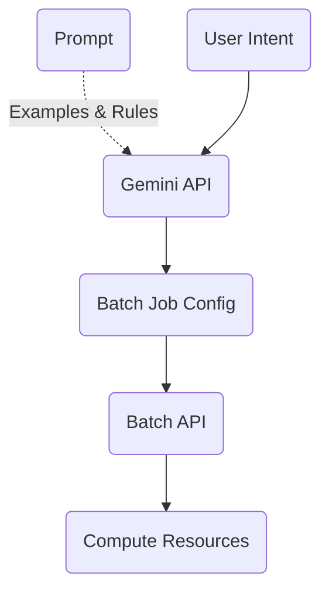

# intent-2-batch
Convert user intent to a GCP batch job

In a common workflow, GCP batch users need to manually convert their intent into a configuration file which can be understood by Batch API before creating a Batch Job.

We can leverage Gemini API to help us convert user intent to a job configuration and then directly feed the configuration to Batch API.

