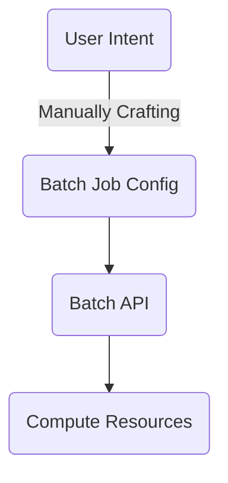
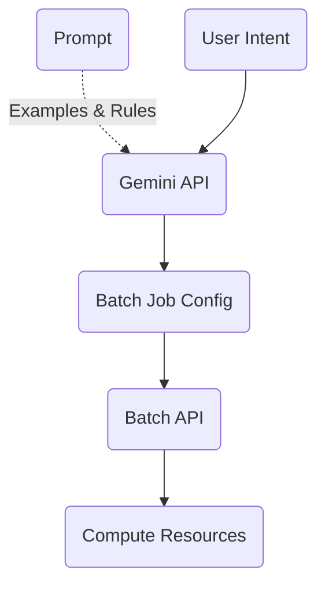

# intent-2-batch
Convert user intent to a GCP batch job

## Context
In a common workflow, GCP batch users need to manually convert their intent into a configuration file which can be understood by Batch API before creating a Batch Job.



We can leverage Gemini API to help us convert user intent to a job configuration and then directly feed the configuration to Batch API.


## How to run
Make sure you have python and gcloud installed in your local env.

* Clone this repo. 
* Enable [Vertex AI APIs](https://cloud.google.com/vertex-ai/docs/start/cloud-environment#enable_vertexai_apis) in your GCP project
* Configure gcloud to use the same project as default project.
```
gcloud config set project PROJECT_ID
```
* Create a virtual env for python
```
cd intent-2-batch
virtualenv intent-2-batch
source intent-2-batch/bin/activate
```
* Install required library
```
pip install --upgrade google-cloud-aiplatform
```
* Run it!
```
python intent2batch.py
```
* Provide your batch job description, example:
```
--------------------------------------------------------------------------------
Describe your desired batch job: I want to create a test batch job which is not mission critical, but I want to create 5 different tasks to run the same test script, please generate the JSON.
--------------------------------------------------------------------------------
Generated content:
{
  "taskGroups": [
    {
      "taskSpec": {
        "runnables": [
          {
            "script": {
              "text": "echo Hello world! This is task ${BATCH_TASK_INDEX}. This job has a total of ${BATCH_TASK_COUNT} tasks."
            }
          }
        ],
        "computeResource": {
          "cpuMilli": 2000,
          "memoryMib": 16
        },
        "maxRetryCount": 2,
        "maxRunDuration": "3600s"
      },
      "taskCount": 5,
      "parallelism": 5
    }
  ],
  "allocationPolicy": {
    "instances": [
      {
        "policy": { "machineType": "e2-standard-4", "provisioningModel": "SPOT" }
      }
    ]
  },
  "logsPolicy": {
    "destination": "CLOUD_LOGGING"
  }
}
--------------------------------------------------------------------------------
Submitting batch job...
gcloud batch jobs submit example-ai-job-2 --location us-central1 --config job_config.json
--------------------------------------------------------------------------------
```
* Input "exit" to exit the program.

## The prompt

A prompt includes `Input`, `Context` and `Examples` ([Reference](https://cloud.google.com/vertex-ai/docs/generative-ai/learn/introduction-prompt-design#context)). 

We are doing a multi-turn generation between the client and Gemini API. The first turn we provide `Input`, `Context` and `Examples`, loaded from [prompt.md](./prompt.md). For all following turns, we are only providing `Input` and expecting(praying) the API to give us some meaningful configurations based on its existing knowledge and what we have taught it.

## Generated configuration

It's interesteing to see Gemini API is using not just our training data but also the knowledge from pre-trained model. For example we see the API generates different values for `machineType` and `provisioningModel` while we haven't included these in our training data. There are many more things we can explore and improve!

## Major TODOs:
* Try different parameters/models.
  * How much does the prompt help? We can compare our result with the response from plain Gemini API and see if our current prompt has really made a difference.  
  * If we relax [temperature](./intent2batch.py#L13) will the output be better or worse?
  * How about other models like [Codey APIs models](https://cloud.google.com/vertex-ai/docs/generative-ai/learn/models#codey-models). I did a few manual testings and it seems Gemini is returning better result.
* Improve [prompt.md](./prompt.md)
  * Will more training examples improve the response quality?
  * Can we experiment more rules, for example always generate script job config instead onf container job config.
  * Can we prompt Gemini to handle more complex logic? For example choose between `policy` and `instanceTemplate` when defining the underlying compute resources.
* Help customer support
  * Can Gemini help to answer customer questions, for example, these ones from https://www.googlecloudcommunity.com?
* Generic exploration on the capability of Gemini API and see what interesting configurations it can produce.
* Make the tool more practical.
  * Asking for target GCP project Id and job name before creating the job.
  * Introducing an extra step to allow users to modify the generated config before submitting through gcloud.

